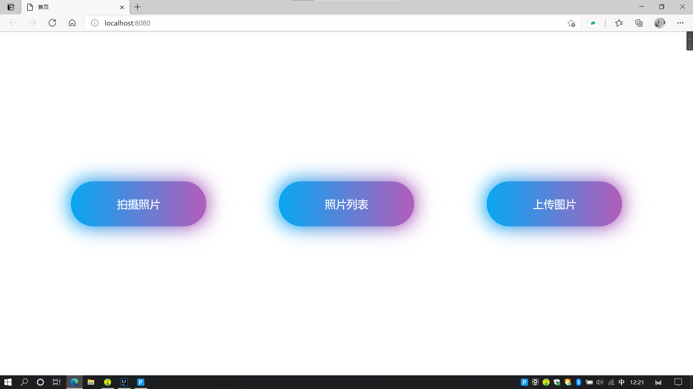
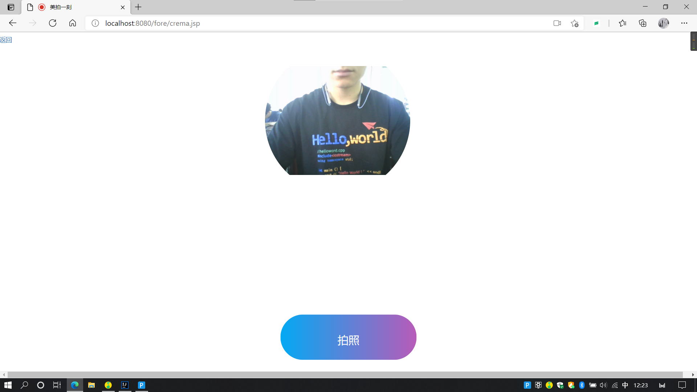
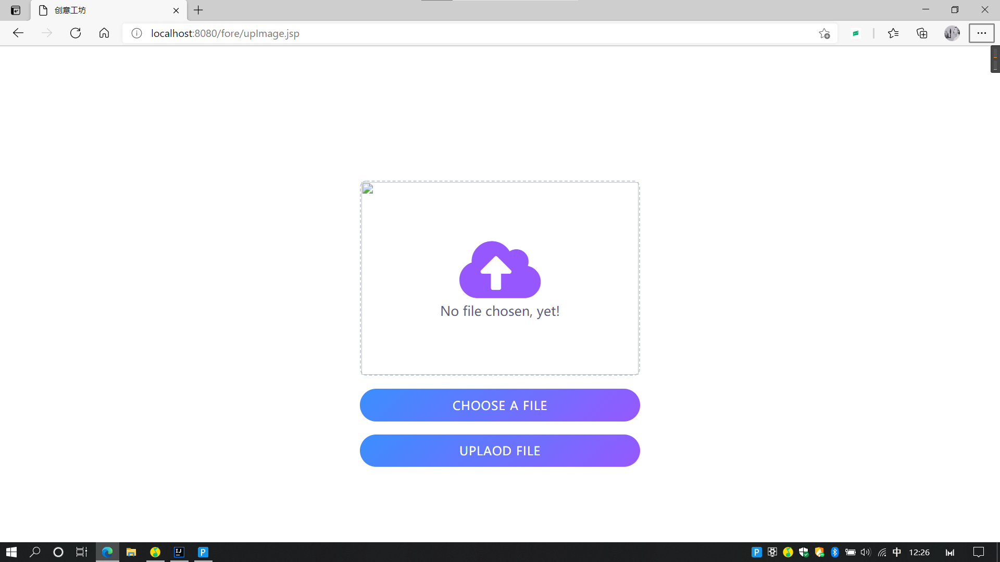
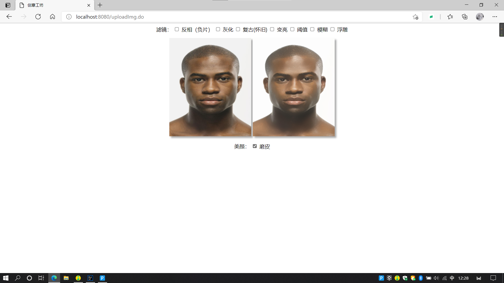

# 基于SSM的美颜网站
## 使用的技术站
- Spring
- SpringMVC
- MyBatis
- jsp
- opencv 图片修整
- tracking.js   人脸追踪
## 开发工具
- IDEA
## 部署教程
 - 项目clone至本地，加载好pom中所使用的依赖
 - 配置tomcat，如图所示
 
 
- 将src/main/resources/sql下的sql文件在数据库管理工具如Navicat中运行创建好数据库  
- 修改druid.properties中数据库相关配置
- 点击运行，访问localhost:8080即可找到页面
## 运行预览
- 首页

- 拍照页

- 上传页

- 修图页

