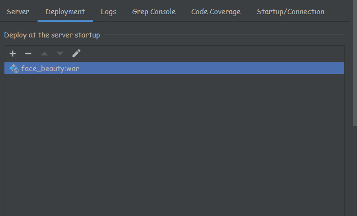
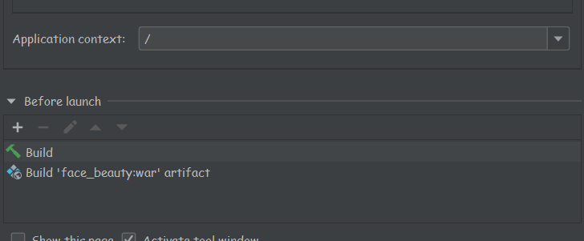

# face_beauty
基于SSM+前端的美颜webapp
## 项目创建背景
数字图像处理的课程设计
## 使用的技术栈
- Spring
- SpringMVC
- MyBatis
- HTML+CSS+Js+jquery
- opencv.js(项目中已封装）
- stackBlur.js(项目中已封装)
## 项目运行环境
- Idea+Tomcat
## 项目配置启动
1. 创建数据库，数据库名称自定义，创建好后运行src/main/resources/sql目录下的sql文件创建表
2. 修改src/main/resources下的druid.properties中的jdbc配置信息
3. 配置tomcat信息，development选择war形式

4. 配置应用访问路径，这样配置直接访问localhost:8080即可访问项目页面

